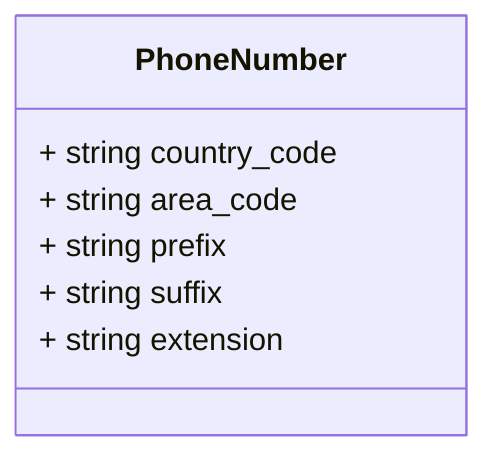

# Package: test.location

 Copyright 2022 Google LLC  Licensed under the Apache License, Version 2.0 (the "License");  you may not use this file except in compliance with the License.  You may obtain a copy of the License at   http://www.apache.org/licenses/LICENSE-2.0  Unless required by applicable law or agreed to in writing, software  distributed under the License is distributed on an "AS IS" BASIS,  WITHOUT WARRANTIES OR CONDITIONS OF ANY KIND, either express or implied.  See the License for the specific language governing permissions and  limitations under the License.   

## Imports

| Import | Description |
|--------|-------------|

## Options

| Name                | Value | Description                                                                                                                                                                                                 |
|---------------------|-------|-------------------------------------------------------------------------------------------------------------------------------------------------------------------------------------------------------------|
| java_multiple_files | true  | Import google timestamp to identify import "google/protobuf/timestamp.proto"; Go Lang Options option go_package = "gcp/proto/test/location"; Java Options option java_package = "gcp.proto.test.location";  |

### PhoneNumber Diagram

## Message: PhoneNumber

FQN: test.location.PhoneNumber

A physical location that can be described with either an address // or a set of geo coordinates. message PhysicalLocation { A postal address for the physical location. message Address { Address type is used to identify the type of address. enum AddressType { A residential address A business address First line of the address string line1 = 1; Second line of the address string line2 = 2; Third line of the address string line3 = 3; The city or township string city = 4; The state or province string state = 5; The postal code string zipcode = 6; The type of address AddressType type = 7; Reserved for future use reserved 8 to 20; The timestamp the record was created google.protobuf.Timestamp created = 1; The mailing address of the location Address address = 2; Longitude degrees int32 longitude_degrees = 3 [json_name = 'lng_d']; Longitude Minutes int32 longitude_minutes = 4 [json_name = 'lng_m']; Longitude Seconds int32 longitude_seconds = 5 [json_name = 'lng_s']; Longitude Degrees int32 latitude_degrees = 6 [json_name = 'lat_d']; Latitude Minutes int32 latitude_minutes = 7 [json_name = 'lat_m']; Latitude Seconds int32 latitude_seconds = 8 [json_name = 'lat_s']; Latitude Direction Code string latitude_direction_code = 9 [json_name = 'lat_dir_code']; Altitude in Meters double altitude_meters = 10 [json_name = 'alt_m']; Additional Meta Data map<string, string> meta = 11; Names for the location repeated string names = 12 [json_name = 'names']; 

| Field        | Ordinal | Type   | Label | Description |
|--------------|---------|--------|-------|-------------|
| country_code | 1       | string |       |             |
| area_code    | 2       | string |       |             |
| prefix       | 3       | string |       |             |
| suffix       | 4       | string |       |             |
| extension    | 5       | string |       |             |

<!-- Created by: Proto Diagram Tool -->
<!-- https://github.com/GoogleCloudPlatform/proto-gen-md-diagrams -->
